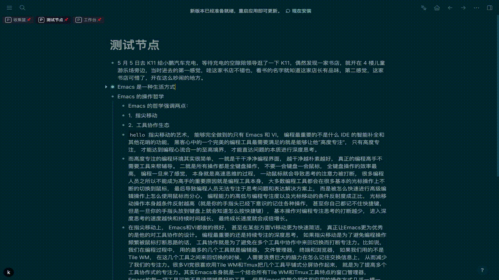

# vim-wyatt-logseq-plugin
这个插件的目的是让 logseq 拥有 vim 一样的编辑体验


中文文档 [README.zh-CN.md](https://github.com/j-wyatt-a/vim-wyatt-logseq-plugin/blob/main/README.zh-CN.md "中文版")

直接解压版 [压缩包](https://github.com/j-wyatt-a/vim-wyatt-logseq-plugin/releases/download/1.1.0/vim-wyatt-logseq-plugin.zip )


## 支持的键位
- `j` 向下移动光标
- `k` 向上移动光标
-  `C-l` redraw
- ; 字符选择模式（char jump mode)
- 具体内容都在这里 `src/config`
  
- 目前的键位对我来说应该已经够了，您要是有需求的话可以自定义
## 启动方式
- clone 本项目
- npm install
- npm run build
- 在 logseq 里手动载入插件，直接选择项目根目录即可

## 画重点
- 如果没有 logseq 团队已经发布的 api，我是不可能做到这些的
- 发布插件的目的是抛砖引玉，希望能出现更好的 vim 插件

## 来由
一直以来，我都是使用 emacs 来写东西的，emacs + evil 的配合让我写字变成一种享受。 神器用久了也是会腻的，这时候 logseq 进入了我的视野，所以我就想换换口味。
但是 logseq 一个没有类似 vim 的编辑体验，这一直阻碍着我使用 logseq。

本来我想着一天没有这个功能，我就一天不用它（说明一直在暗暗关注着人家）。 然后有一天我看到了 logseq-plugin-vim-shortcuts 这个插件，想着终于可以入坑了。
然后发现我还是太年轻了，它不能移动光标。但是这位开发者给了我勇气，我试着自己来实现。

目前算是实现了一些主要功能，我完全可以入坑 logseq 了。也希望它能帮到你们 happy hacking!

## 主要原理
```js
// 监听主页面的按键输入
top.document.onkeydown = async function (e) {
  console.log(e)

  // 阻止按键在文本框输入字符,然后识别成命令
  e.preventDefault()

  // 在按下 esc 键后,因为没有拦截到它,所以光标还是消失了
  let blockUUID = await logseq.Editor.getCurrentBlock();
  // 现在使用这个方法,重新进入编辑模式,它会复现光标
  await logseq.Editor.editBlock(blockUUID.uuid);
}
```

## 感谢
- logseq
- logseq-plugin-vim-shortcuts

## Licence
MIT
